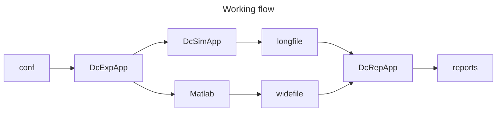
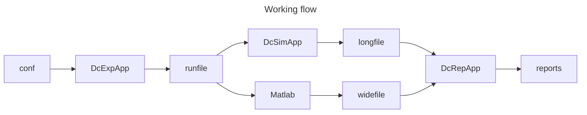

# USER GUIDE (dcSimulator)
**Document Level: A (User)**  
**Purpose:** Practical guide for installing, configuring and running simulations.

---

## 1. Introduction
Key points extracted from legacy guide:
- DcSim Electrical Model Overview – v0.4
- Purpose
- The purpose of DcSim is to simulate how train traf fic interacts with the electrical infrastructure in
- DC electrical modeling, multiple trains, time-stepped simulation, and detailed energy flow
- DcSim Electrical Model Overview
- DC Lines
- The configuration is defined in application.conf  under the dcsim  root. Below , each section
- Purpose: DcSimApp  runs the simulation based on your configuration file.

Refer to `terms.md` for definitions (English with Swedish equivalents).

---

## 2. Installation & Run Environment
Minimum recommended environment:
- Java 17+ (or project target runtime)
- Read/write permissions for input/output paths

### 2.1 Run Modes
- FAST: batch-oriented, runs as fast as possible.
- REAL_TIME: paced against wall-clock for demonstrations.
  Legacy notes:
- simulationStart  (String)
- simulationStart = "2025-08-11T08:00:00+02:00"
- 6. How to Run
- Purpose: DcSimApp  runs the simulation based on your configuration file.
- Using sbt:
- Usagesbt runMain dcsim.DcSimApp

---

## 3. Basic Usage
1) Prepare `application.conf` (grid, traffic, powerProfiles, simulationControl).
2) Choose a case study (Section 6).
3) Run the simulator (launcher/IDE).
4) Inspect CSV outputs and plots.

---

## 4. Configuration Reference (HOCON)
All configuration lives under `dcsim.*` in `application.conf`.

### 4.1 Grid (`dcsim.grid`)
- groundNodeId – id of the 0 V reference node
- nodes – list of nodes (ids, optional metadata)
- lines – resistive connections (Ω or Ω/km + length)
- substations – EMF + Rint, diode behavior (no backfeed)

### 4.2 Traffic (`dcsim.traffic`)
- trains – instances with start times and template refs
- positions – anchor nodes or longitudinal positions (km+m)

### 4.3 Power Profiles (`dcsim.powerProfiles`)
- templates – reusable profiles (motoring, braking, auxiliaries)
- sources – Excel/CSV files and interpolation details

### 4.4 Simulation Control (`dcsim.simulationControl`)
- tickDuration – step size in seconds
- simulationStart / simulationEnd – window (seconds-of-day)
- mode – FAST or REAL_TIME

Legacy configuration lines from PDF:
- The configuration is defined in application.conf  under the dcsim  root. Below , each section
- 2. grid
- grid {
- 3. traffic
- 4. powerProfiles  ]
- traffic {
- 5. simulationControl
- powerProfiles {
- simulationControl {
- Usagesbt runMain dcsim.DcSimApp
- Place application.conf  at project/<project_name>/ .

---

## 5. Results & Visualization
Typical outputs:
- CSV with `time`, `step`, `V(node)`, `P[...]`, aggregates (`P_trains`, `P_substations_out`, `P_lines`, `P_brake`).
- Optional long table for pivoting in Excel:

    time | object | signal | value
      -----|--------|--------|------
    12.0 | Train_1 | P_req | 5000
    12.0 | Train_1 | P_delivered | 4800
    12.0 | Substation_A | Voltage | 740

Open in Excel and insert a PivotTable to slice by object, signal, and time.

Legacy output notes from PDF:
- terms of power flows, voltage stability , losses, and energy usage. The model supports realistic
- Supply power only when voltage at feeding node is below EMF .
- Output Variables
- Example:Regeneration to line if voltage < regeneration cutof f (e.g., 850 V).
- Above maximum voltage (e.g., 1000 V), all braking power goes to resistor .
- Node voltages per timestep.
- All outputs exportable to CSV and/or Excel.
- Excel .xlsx  power profile files

---

## 6. Case Studies (Examples)

    Case         | Description                                 | Input files                             | Expected outcome
    -------------|---------------------------------------------|-----------------------------------------|------------------
    3subs1train  | Three substations feeding one train         | `application.conf` (3 subst., 1 train)  | Voltage profile; power balance
    3subs2train  | Three substations feeding two trains        | `application.conf` (3 subst., 2 trains) | Shared load; regenerative effects
    symphony     | Realistic multi-train timetable-driven case | `application.conf` + profiles/timetable | Aggregated load; timetable plots

---

## 7. Troubleshooting
- Empty CSV: check output folder and flush-on-tick.
- Strange voltages: verify ground, EMF/Rint, line units (Ω vs Ω/km).
- Instability: lower tickDuration; verify profile interpolation.
- Regen missing: confirm diode clamp & thresholds; check P_brake rows.

---

## 8. Appendix
### 8.1 Folder layout (example)

    docs/
    ├── A_user/
    │   ├── USER_GUIDE.md
    │   ├── modelDescription.md
    │   ├── terms.md
    │   └── examples/
    ├── B_developer/
    │   ├── README_dev.md
    │   ├── softwareSpecification.md
    │   ├── testPlan.md
    └── C_planning/
        ├── docPlan.md
        ├── prototypePlan.md
        └── progressStatus.md

### 8.2 Terminology
See `terms.md` for glossary and conventions.


---

## Output Handling (since v0.9)

From version v0.9, dc-simulator stores all simulation results in a deterministic and structured location.

This means:

- Output does not depend on where you launch the simulator.
- Running from different working directories produces identical result locations.
- Results from different scenarios do not overwrite each other.
- Each scenario run can be uniquely identified from its directory structure.

### How Results Are Organized

Simulation results are grouped by:

- Project
- Scenario
- Run configuration

This allows you to:

- Compare multiple scenario runs safely.
- Re-run simulations without accidental overwrites.
- Archive or post-process results consistently.

You do not need to change your working directory before running the simulator.

## Input File Paths

When specifying file paths in `application.conf`, you may use:

- Absolute paths
- Paths relative to the location of the configuration file

Example:

```hocon
dcsim.exportRunExcel = "T1/A-B.xlsx"
```

If the configuration file is located in:

project/validationTests/3S1T/

the Excel file is resolved relative to that directory.

This makes scenario folders self-contained and portable.

Strict Input Validation

dc-simulator performs strict validation of input files:

Incorrect CSV headers cause immediate failure.

Missing required columns cause immediate failure.

Out-of-range position values cause a clear error message.

Validation errors stop the simulation before computation begins.

This ensures reproducible and reliable simulations.

Java–MATLAB Integration

dc-simulator supports integration with MATLAB via exported result files.

Standard Workflow

Run simulation from Java.

Results are written in structured CSV format.

MATLAB reads result files for analysis and visualization.

The simulator guarantees:

Stable CSV schema.

Deterministic output location.

Consistent long-format result structure.

Long-Format Results

Simulation results are written in long format:

time_s,
project,
scenario,
base_hash,
object_type,
object_id,
signal,
value,
unit,
stage,
iter,
note

This format is:

Efficient for large datasets.

Easy to transform into wide format in MATLAB.

Stable across environments.

Example MATLAB Usage
data = readtable("results/.../longtable.csv");
plot(data.time_s, data.value);

The output location is consistent regardless of where the Java process was started.

Reproducibility

Simulations are reproducible across environments:

No dependency on working directory.

Explicit input configuration.

Strict schema validation.

Deterministic output structure.

_This USER_GUIDE.md was reconstructed from legacy USER_GUIDE.pdf and normalized for portability._

## CLI arguments and deterministic run layout

dc-simulator takes **two command-line arguments**:

1. `conf` (string, required)  
   Path to the scenario configuration file.

2. `output` (string, optional)  
   Root directory for generated artifacts. If omitted, the simulator creates a local workspace under the scenario input
   directory.

These arguments are used to derive:

- `projectId`
- `scenarioId`
- `configFile`
- `inputDir`
- `outputRoot`
- `exportDir`
- `resultsDir`

### Definitions

- **projectId**  
  A stable identifier derived from the directory containing the scenario configuration file.

- **scenarioId**  
  A stable identifier derived from the configuration file name without extension.

- **configFile**  
  The resolved absolute path to the scenario configuration file.

- **inputDir**  
  The directory containing the scenario inputs (config, templates, Excel profiles, etc.).

- **outputRoot**  
  Root directory for all generated dc-simulator artifacts.

- **exportDir**  
  Directory containing exported CSV inputs:

      exportDir = outputRoot/exports

- **resultsDir**  
  Directory containing solver outputs:

      resultsDir = outputRoot/results

- **reportsDir**  
  Directory containing analysis and reports:

      reportsDir = outputRoot/reports

### Output root resolution

If the optional `output` argument is omitted:

    outputRoot = inputDir/dc

If the optional `output` argument is provided:

    outputRoot = <resolved output argument>

### Notes

- Arguments may be **absolute** or **relative** paths.
- Relative paths are resolved against the **current working directory (CWD)**.
- This layout ensures that all generated artifacts are kept under a single deterministic root.

### Examples

#### Example A — Absolute config path (output omitted)

Command:

- `dcsim "T:/gemensamt/A/B/C/x.conf"`

Derived layout:

- `projectId = "C"`
- `scenarioId = "x"`
- `configFile = "T:/gemensamt/A/B/C/x.conf"`
- `inputDir = "T:/gemensamt/A/B/C"`
- `outputRoot = "T:/gemensamt/A/B/C/dc"`
- `exportDir = "T:/gemensamt/A/B/C/dc/exports"`
- `resultsDir = "T:/gemensamt/A/B/C/dc/results"`

#### Example B — Absolute config path + explicit output root

Command:

- `dcsim "C:/A/B/C/x.conf" "C:/distribution"`

Derived layout:

- `projectId = "C"`
- `scenarioId = "x"`
- `configFile = "C:/A/B/C/x.conf"`
- `inputDir = "C:/A/B/C"`
- `outputRoot = "C:/distribution"`
- `exportDir = "C:/distribution/exports"`
- `resultsDir = "C:/distribution/results"`

#### Example C — CWD-relative config path (output omitted)

Assume CWD is `D:/tools/dc-simulator`.

Command:

- `dcsim "myProject/myFirstScenario.conf"`

Derived layout:

- `projectId = "myProject"`
- `scenarioId = "myFirstScenario"`
- `configFile = "D:/tools/dc-simulator/project/myProject/myFirstScenario.conf"`
- `inputDir = "D:/tools/dc-simulator/project/myProject"`
- `outputRoot = "D:/tools/dc-simulator/project/myProject/dc"`
- `exportDir = "D:/tools/dc-simulator/project/myProject/dc/exports"`
- `resultsDir = "D:/tools/dc-simulator/project/myProject/dc/results"`

### Recommended usage

- Keep **inputs** (scenario configs, templates, Excel profiles) under `project/**`.
- Keep all generated dc-simulator artifacts under a single deterministic root:
  - `inputDir/dc` for local runs
  - an explicit output root for distribution or pipeline runs
- For reproducible and shareable runs, prefer an explicit output root.
- If generated files appear outside `outputRoot`, treat that as a path-resolution defect.



