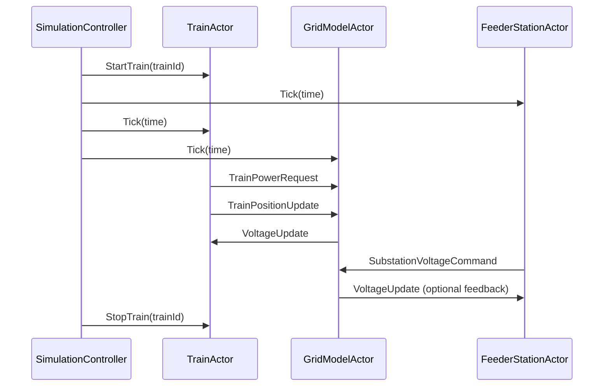
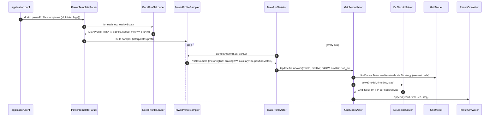

# README_utv.md – Development and Architecture Guide

This document provides implementation-specific guidance for developers working on the simulator's internals. It covers the Akka actor system, message handling, and component lifecycles.

## Purpose
This guide documents how the system is structured in terms of concurrent components and actors. It is focused on the simulation engine and its extensibility using Akka.

---
# README\_utv.md – Development and Architecture Guide

This document provides implementation-specific guidance for developers working on the simulator's internals. It covers the Akka actor system, message handling, and component lifecycles.

## Purpose

This guide documents how the system is structured in terms of concurrent components and actors. It is focused on the simulation engine and its extensibility using Akka.

---

## Actor Overview

The simulation loop is built using Akka actors. Each key component is modeled as an actor:

* `SimulationControllerActor`: master actor that advances the clock and coordinates other actors.
* `TrainActor`: manages an individual train, updates its power demand and reports position.
* `GridModelActor`: maintains the nodal admittance matrix, updates voltages.
* `FeederStationActor`: injects substation power into the grid model.

## Actor Interaction – Sequence Diagram



## Event Handling – TrainActor

* **At scheduled start time:**

  * Spawn `TrainActor`
  * Split overhead line at train position → create node
  * Connect train to grid

* **At scheduled end:**

  * Disconnect train
  * Remove node
  * Stop `TrainActor`

* **During simulation:**

  * Request power from profile
  * Update position
  * Receive voltage
  * Compute current and send to grid

* **When passing a node:** update topology if needed.

## Event Handling – FeederStationActor

* At each tick:

  * Read current voltage
  * If below EMF → inject power
  * No back-feed allowed (diode behavior)
  * Optionally report to controller

## Event Handling – GridModelActor

* Receives all `TrainPowerRequest`, `SubstationCommand`
* Updates Y-matrix
* Solves voltage
* Responds with `VoltageUpdate`s

## Lifecycle Considerations TODO

* Actor creation: `context.spawn(...)`
* Shutdown: `context.stop(...)`
* Supervision for crash recovery
* Virtual time control
* Tick frequency setup
* Logging to file or terminal

## Message Format TODO

Include formal definitions in codebase, e.g.

```scala
case class Tick(time: Double)
case class StartTrain(trainId: String)
case class StopTrain(trainId: String)
case class TrainPowerRequest(time: Double, id: String, power: Double)
case class VoltageUpdate(voltage: Double)
```

## Configuration Handling TODO

* All parameters configurable via `.conf` files (HOCON)
* Train start times
* Grid topology
* Substation parameters
* Tick frequency

## Future Work TODO

* Supervisor strategy
* Reusable testing harness
* Akka Typed migration (if not already used)
* Integration with GUI/logging backend

---

## Power profile data flow (Excel → sampler → actors → solver)

### Sequence (high level)



### Flowchart (where data lives)

```mermaid
flowchart LR
    A[application.conf<br/>powerProfiles.templates] -->|folders + legs| B(PowerTemplateParser)
    B -->|xlsx paths| C[ExcelProfileLoader]
    C -->|List&lt;ProfilePoint&gt;| D(PowerProfileSampler)
    D -->|ProfileSample per tick| E[TrainProfileActor]
    E -->|UpdateTrainPower| F[GridModelActor]
    F -->|Topologi map| G[GridModel/TrainLoad]
    F -->|solve(...)| H[DcElectricSolver]
    H -->|GridResult| I[ResultCsvWriter]
    I -->|CSV rows| J[(output/electrical.csv)]
```

### Notes for implementers

* **Config → files**
  `dcsim.powerProfiles.templates[].folder` + `legs[].file` pekar på Excel-filerna:

  ```
  powerProfiles {
    templates = [
      {
        id = "T1"
        folder = "input/loads/T1"
        legs = [
          { fromStation = "A", toStation = "B", file = "A-B.xlsx" }
        ]
      }
    ]
  }
  ```
* **Excel columns (per USER\_GUIDE):**
  `time [s]`, `bisPosition [km,m]`, `speed [m/s]`,
  `primaryMotoringPower [kW]`, `primaryMotorBrakingPower [kW]`.
* **Sampler API:**
  `ProfileSample sampleAt(double timeSec, double auxiliaryKW)` → returnerar (motoringKW, brakingKW, auxiliaryKW, positionMeters).
  Hjälplaster hanteras enligt flaggan `motoringAndAuxiliariesInSameModel`.
* **Binding/topologi:**
  Per tick placerar `GridModelActor` tågets `TrainLoad` på närmaste nod (v0.4) via `Topology.nearestNode(lineId, meters)` och kopplar `toNode = ground`.
* **Solver/output:**
  `DcElectricSolver.solve(...)` ger `GridResult`.
  `ResultCsvWriter.append(...)` skriver tidrad (noder, per-device P, aggregat, balans) till `output/electrical.csv`.

---

## Getting started

To quickly verify the pipeline end-to-end:

1. **Minimal test:** Run `MinimalTest` – checks actor startup, parsing, and solver loop with dummy data.
2. **Symphony scenario:** Run `symphony.conf` – larger setup with multiple trains and feeders.
3. **3subs1train scenario:** Run `3subs1train` – dedicated case for verifying train movement and transitions between multiple substations.

Expected output: `output/electrical.csv` with per-tick node/device values. Use Excel or a plotting tool to inspect voltage profiles, requested/delivered power, and energy balances.

---

(c) Railway Simulation Project, 2025

## Actor Overview

The simulation loop is built using Akka actors. Each key component is modeled as an actor:

- `SimulationControllerActor`: master actor that advances the clock and coordinates other actors.
- `TrainActor`: manages an individual train, updates its power demand and reports position.
- `GridModelActor`: maintains the nodal admittance matrix, updates voltages.
- `FeederStationActor`: injects substation power into the grid model.


## Actor Interaction – Sequence Diagram


## Event Handling – TrainActor

- **At scheduled start time:**
  - Spawn `TrainActor`
  - Split overhead line at train position → create node
  - Connect train to grid

- **At scheduled end:**
  - Disconnect train
  - Remove node
  - Stop `TrainActor`

- **During simulation:**
  - Request power from profile
  - Update position
  - Receive voltage
  - Compute current and send to grid

- **When passing a node:** update topology if needed.

## Event Handling – FeederStationActor

- At each tick:
  - Read current voltage
  - If below EMF → inject power
  - No back-feed allowed (diode behavior)
  - Optionally report to controller

## Event Handling – GridModelActor

- Receives all `TrainPowerRequest`, `SubstationCommand`
- Updates Y-matrix
- Solves voltage
- Responds with `VoltageUpdate`s

## Lifecycle Considerations ✅ TODO
- Actor creation: `context.spawn(...)`
- Shutdown: `context.stop(...)`
- Supervision for crash recovery
- Virtual time control
- Tick frequency setup
- Logging to file or terminal

## Message Format ✅ TODO
Include formal definitions in codebase, e.g.
```scala
case class Tick(time: Double)
case class StartTrain(trainId: String)
case class StopTrain(trainId: String)
case class TrainPowerRequest(time: Double, id: String, power: Double)
case class VoltageUpdate(voltage: Double)
```

## Configuration Handling ✅ TODO
- All parameters configurable via `.conf` files (HOCON)
- Train start times
- Grid topology
- Substation parameters
- Tick frequency

## Future Work ✅ TODO
- Supervisor strategy
- Reusable testing harness
- Akka Typed migration (if not already used)
- Integration with GUI/logging backend

---
(c) Railway Simulation Project, 2025
