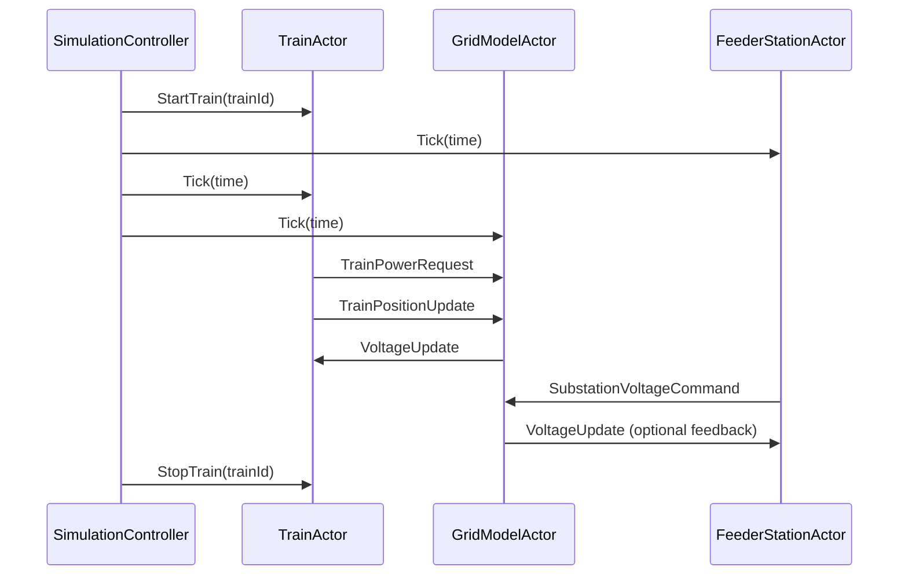

# README_utv.md – Development and Architecture Guide

This document provides implementation-specific guidance for developers working on the simulator's internals. It covers the Akka actor system, message handling, and component lifecycles.

## Purpose
This guide documents how the system is structured in terms of concurrent components and actors. It is focused on the simulation engine and its extensibility using Akka.

---

## Actor Overview

The simulation loop is built using Akka actors. Each key component is modeled as an actor:

- `SimulationControllerActor`: master actor that advances the clock and coordinates other actors.
- `TrainActor`: manages an individual train, updates its power demand and reports position.
- `GridModelActor`: maintains the nodal admittance matrix, updates voltages.
- `FeederStationActor`: injects substation power into the grid model.


## Actor Interaction – Sequence Diagram



## Event Handling – TrainActor

- **At scheduled start time:**
  - Spawn `TrainActor`
  - Split overhead line at train position → create node
  - Connect train to grid

- **At scheduled end:**
  - Disconnect train
  - Remove node
  - Stop `TrainActor`

- **During simulation:**
  - Request power from profile
  - Update position
  - Receive voltage
  - Compute current and send to grid

- **When passing a node:** update topology if needed.

## Event Handling – FeederStationActor

- At each tick:
  - Read current voltage
  - If below EMF → inject power
  - No backfeed allowed (diode behavior)
  - Optionally report to controller

## Event Handling – GridModelActor

- Receives all `TrainPowerRequest`, `SubstationCommand`
- Updates Y-matrix
- Solves voltage
- Responds with `VoltageUpdate`s

## Lifecycle Considerations ✅ TODO
- Actor creation: `context.spawn(...)`
- Shutdown: `context.stop(...)`
- Supervision for crash recovery
- Virtual time control
- Tick frequency setup
- Logging to file or terminal

## Message Format ✅ TODO
Include formal definitions in codebase, e.g.
```scala
case class Tick(time: Double)
case class StartTrain(trainId: String)
case class StopTrain(trainId: String)
case class TrainPowerRequest(time: Double, id: String, power: Double)
case class VoltageUpdate(voltage: Double)
```

## Configuration Handling ✅ TODO
- All parameters configurable via `.conf` files (HOCON)
- Train start times
- Grid topology
- Substation parameters
- Tick frequency

## Future Work ✅ TODO
- Supervisor strategy
- Reusable testing harness
- Akka Typed migration (if not already used)
- Integration with GUI/logging backend

---
(c) Railway Simulation Project, 2025
