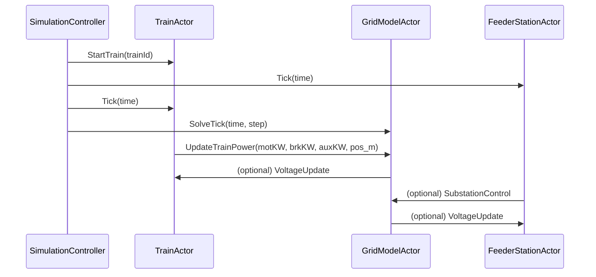
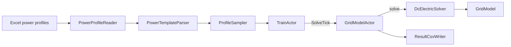

# README_utv.md – Development and Architecture Guide

This document provides implementation-specific guidance for developers working on the simulator's internals. It covers the Akka actor system, message handling, component lifecycles, and operational checklists for commits and documentation hygiene.

## Purpose
This guide documents how the system is structured in terms of concurrent components and actors. It is focused on the simulation engine and its extensibility using Akka.

---

## Actor Overview

The simulation loop is built using Akka actors. Each key component is modeled as an actor:

- `SimulationControllerActor`: master actor that advances the clock and coordinates other actors.
- `TrainActor`: manages an individual train, updates its power demand and reports position.
- `GridModelActor`: maintains the nodal admittance matrix (Y), updates voltages, and writes results.
- `FeederStationActor` (optional, concept): injects substation power commands into the grid model.

## Actor Interaction – Sequence Diagram



## Event Handling – TrainActor

- **At scheduled start time**
  - Spawn `TrainActor`
  - (Future) split line and create/move coupling node near train position
  - Connect `TrainLoad` to grid

- **At scheduled end**
  - Disconnect train
  - Remove temporary node(s)
  - Stop `TrainActor`

- **Each tick**
  - Sample power profile (motoring, braking, auxiliaries)
  - Update position
  - Send `UpdateTrainPower` to `GridModelActor`

## Event Handling – GridModelActor

- Receives `UpdateTrainPower`
- Ensures a `TrainLoad` device exists and binds it to the (current) anchor node
- Calls solver and obtains `GridResult` (node voltages + per-device powers/currents)
- Post-processes powers (substations diode behavior, lines I²R, trains incl. brake pseudo-devices)
- Appends CSV row via `ResultCsvWriter`

## Lifecycle & Supervision (TODO)
- Actor creation: `context.spawn(...)`
- Shutdown and coordinated stop
- Supervision strategy for recovery
- Virtual time control and tick scheduling
- Logging configuration (file/console) and log levels

## Message Format (TODO – formalize)
```scala
case class Tick(time: Double)
case class SolveTick(time: Double, step: Int)
case class StartTrain(trainId: String)
case class StopTrain(trainId: String)
case class UpdateTrainPower(trainId: String, motoringKW: Double, brakingKW: Double, auxiliaryKW: Double, positionMeters: Double)
```

## Configuration (HOCON) (TODO – expand)
- `simulationControl`: tick duration, start/end time, `simulationSpeed` (FAST/REAL_TIME)
- `grid`: nodes, lines, substations (EMF, Rint), ground node id
- `powerProfiles`: templates, auxiliary handling, file paths
- `traffic`: timetable with departures, template mapping

---

## Developer Checklists

### A. Commit Checklist (what to do at commit time)
1. **Build & format**
  - Project compiles cleanly (no warnings if possible).
  - Code formatted (Java/Scala) and imports optimized.
2. **Fast functional smoke**
  - Run the `3subs1train` scenario (FAST mode); verify CSV is non-empty and coherent.
  - Spot-check: node voltages reasonable, substations positive output when feeding, line losses ≥ 0, train requested vs delivered powers make sense.
3. **Result I/O sanity**
  - CSV header contains nodes, `P[...]` per device, `P_req[train]`, `P_brake[train]`, aggregates.
  - No accidental header duplication when appending.
4. **Logs**
  - No stack traces or ERROR logs on nominal runs.
5. **Docs and metadata**
  - Update `CHANGELOG.md` (see routines below).
  - Update `ProgressLog.md` with a concise summary of what changed and why.
  - If scope/plan changed, adjust `PrototypePlan.md` (see routines below).
6. **Version/tag (if applicable)**
  - If the change warrants it, bump version and tag.
7. **Run time check (REAL_TIME only if needed)**
  - If you touched scheduling, quick run in REAL_TIME to confirm pacing.

### B. Routines for: `CHANGELOG.md`, `ProgressLog.md`, `PrototypePlan.md`
- **CHANGELOG.md**
  - Under `## [Unreleased]`, add entries for `Added / Changed / Fixed / Removed`.
  - On release, cut a new section with date; move entries from `Unreleased` to the new section.
  - Keep entries terse but specific (“Compute substation diode power in post-process”, not “misc fixes”).
- **ProgressLog.md**
  - Append the day’s work: the problem, approach, key commits, and any regressions found.
  - Focus on traceability and intent—someone should be able to reconstruct *why* a change occurred.
- **PrototypePlan.md**
  - Update the “Next steps” section when priorities change.
  - Keep acceptance criteria explicit (inputs/outputs, expected signs/ranges, plots to verify).
  - Note dependencies on data (e.g., profiles) and on grid topology.

---

## Power profile data flow (Excel → sampler → actors → solver)



### Excel columns (as of USER_GUIDE)
- `time [s]`, `bisPosition [km,m]`, `speed [m/s]`,
- `primaryMotoringPower [kW]` (≥ 0),
- `primaryMotorBrakingPower [kW]` (≤ 0 for regen in our pipeline).

---

## Quick Scenarios

- **Minimal test:** actor bootstrap and CSV creation
- **3subs1train:** end-to-end validation of node voltages, diode substations, line losses, braking transition
- **Larger timetable:** performance sweep (FAST vs REAL_TIME)

---

## TODOs & Backlog Hooks
- Add `P_lack = P_req - P_trains` column (per-train & total).
- Replace or redefine “Balance” as a strict conservation check (should be ≈ 0).
- Option to flip voltage signs at export to present positive node potentials.
- Multi-sheet export: global, per-train, per-substation, per-line.
- Write checklists for commit hygiene and doc updates (this file).
- Expand unit tests (diode behavior, braking transitions, topology churn).

---

(c) Railway Simulation Project, 2025
