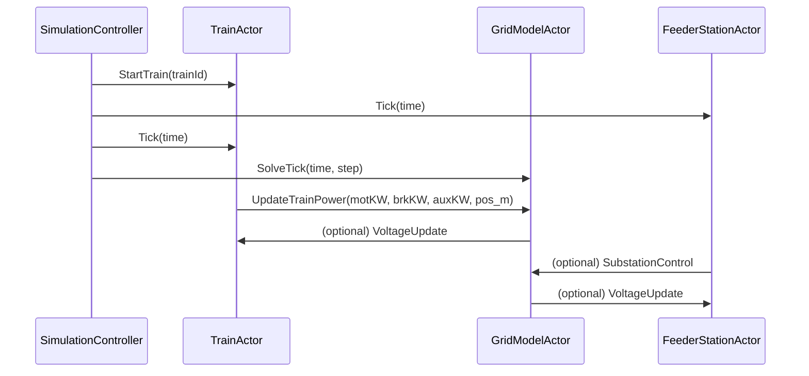
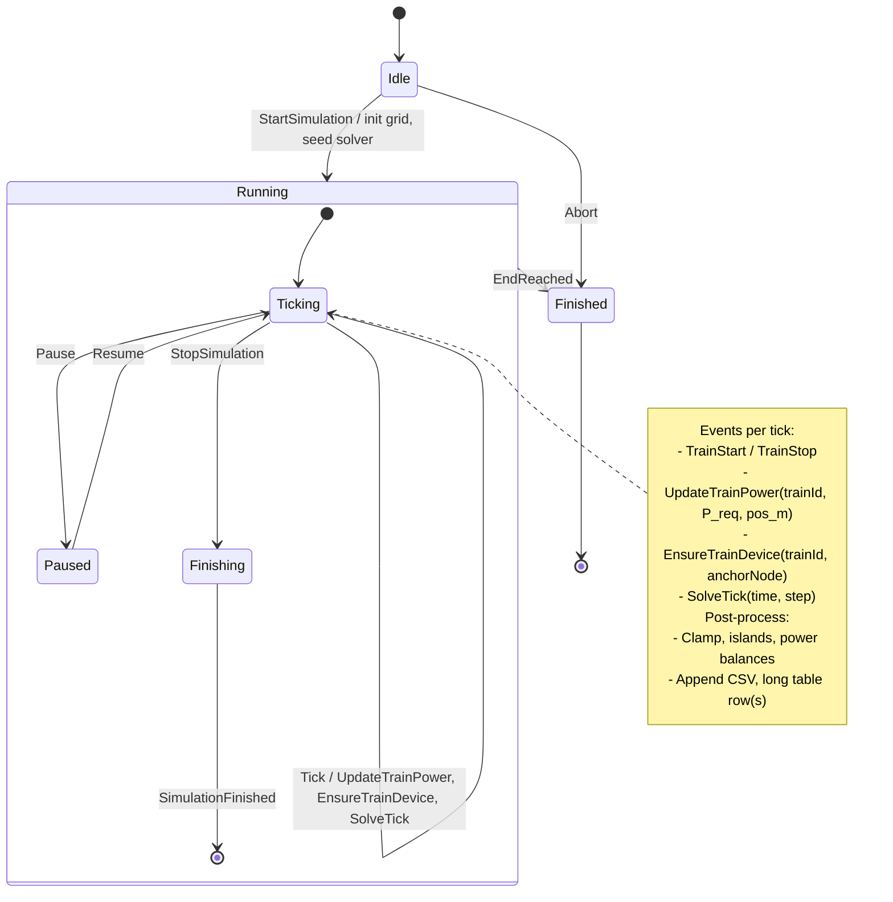
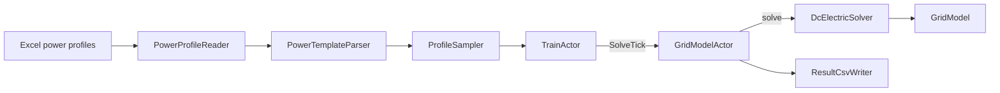

# README_utv (Developer Documentation)

>*Formatting convention:* Indented blocks (4 spaces) are used for trees, commands, and diagrams for portability. Triple backticks are reserved only for executable code (Scala/Java/shell).

This document provides developer-oriented stories describing the architecture and functionality of **dcSimulator**.  
Each story captures a coherent part of the system.  
_All original content is preserved, reorganized and expanded._

---

## Story 1: Simulation Loop

The simulation loop orchestrates the execution of the system.  
Actors, scheduling, message flow, and state transitions are described here.

### Actor Overview

The simulation loop is built using Akka actors. Each key component is modeled as an actor:

- `SimulationControllerActor`: master actor that advances the clock and coordinates other actors.
- `TrainActor`: manages an individual train, updates its power demand and reports position.
- `GridModelActor`: maintains the nodal admittance matrix (Y), updates voltages, and writes results.
- `FeederStationActor` (optional, concept): injects substation power commands into the grid model.

### Actor Interaction – Sequence Diagram



### Event Handling – TrainActor

- **At scheduled start time**
    - Spawn `TrainActor`
    - (Future) split line and create/move coupling node near train position
    - Connect `TrainLoad` to grid

- **At scheduled end**
    - Disconnect train
    - Remove temporary node(s)
    - Stop `TrainActor`

- **Each tick**
    - Sample power profile (motoring, braking, auxiliaries)
    - Update position
    - Send `UpdateTrainPower` to `GridModelActor`

### Event Handling – GridModelActor

- Receives `UpdateTrainPower`
- Ensures a `TrainLoad` device exists and binds it to the (current) anchor node
- Calls solver and obtains `GridResult` (node voltages + per-device powers/currents)
- Post-processes powers (substations diode behavior, lines I²R, trains incl. brake pseudo-devices)
- Appends CSV row via `ResultCsvWriter`

### Lifecycle & Supervision (TODO)
- Actor creation: `context.spawn(...)`
- Shutdown and coordinated stop
- Supervision strategy for recovery
- Virtual time control and tick scheduling
- Logging configuration (file/console) and log levels

### Message Format (TODO – formalize)
```scala
case class Tick(time: Double)
case class SolveTick(time: Double, step: Int)
case class StartTrain(trainId: String)
case class StopTrain(trainId: String)
case class UpdateTrainPower(trainId: String, motoringKW: Double, brakingKW: Double, auxiliaryKW: Double, positionMeters: Double)
```

### Configuration (HOCON) (TODO – expand)
- `simulationControl`: tick duration, start/end time, `simulationSpeed` (FAST/REAL_TIME)
- `grid`: nodes, lines, substations (EMF, Rint), ground node id
- `powerProfiles`: templates, auxiliary handling, file paths
- `traffic`: timetable with departures, template mapping

---

## Story 2: Calculation Process (Beräkningsprocessen)

The **calculation process** is the solver’s heart.  
It determines how electrical states are computed at each simulation step.

### Solver cycle
1. **Initialization** – Y-matrix and node set created, devices registered.
2. **Stamping** – Each device contributes its conductance/current to Y and J.
3. **Seed / Relaxation** – Initial guesses (seed) may be applied; iterative relaxation (e.g. Gauss–Seidel) can refine solution.
4. **Solve** – Linear solver (LU factorization or relaxation) computes node voltages.
5. **Clamp / Island handling** – Overvoltage is clamped (e.g. diode clamp), isolated islands are handled separately.
6. **Post-processing** – Currents and powers are computed, mismatches checked.
7. **Events** – Tick, TrainStart, TrainStop, SimulationFinished are dispatched.

### States and events
- **Idle** – System configured, not running.
- **Running** – Loop active, solvers executed per tick.
- **Paused** – Simulation suspended by controller.
- **Finished** – End condition reached, actors terminated.

Events include: `Tick`, `TrainStart`, `TrainStop`, `EnsureTrainDevice`, `UpdateTrainPower`, `SolveTick`, `SimulationFinished`.

### Calculation Model — State/Event Diagram


---

## Story 3: Result Handling (Resultathantering)

Simulation produces structured results. Handling ensures usability for analysis.

### Output artifacts
- **CSV files** – Lazy-header, per-device and aggregate columns.
- **Plots** – Timetable, load profiles, voltage profiles.
- **Aggregates** – Summed train load, substations output, losses.

### Long table format
All results can be represented in a **normalized long table**:

    time | object | signal | value
    -----|--------|--------|------
    12.0 | Train_1 | P_req | 5000
    12.0 | Train_1 | P_delivered | 4800
    12.0 | Substation_A | Voltage | 740

This long table format allows **Excel PivotTables** or BI tools to easily slice and aggregate data by object, signal, or time.

---

## Story 4: Configuration & Input Data

Configuration is based on **HOCON** files.  
Inputs include:
- Grid description (`dcsim.grid`)
- Traffic definitions (`dcsim.traffic`)
- Power profiles (`dcsim.powerProfiles`)
- Simulation control (`dcsim.simulationControl`)

Excel-based power profiles are interpolated into `PowerPoint` series.  
Timetables define train instantiations.

---

## Story 5: Lifecycle & Supervision

Actors follow a lifecycle coordinated by Akka supervision.
- Creation: via SimulationController.
- Running: periodic `Tick` messages.
- Shutdown: `CoordinatedShutdown`, ensuring CSVs flushed.
- Dead letters logged and monitored.

---

## Story 6: Developer Hygiene & Routines

- **Checklists** ensure consistent development.
- **Coding standards**: English comments, clear naming, separation of domain vs IT.
- **Regression tests** (see `testPlan.md`) keep solver correctness intact.

### Developer Checklist

- **Before coding**
  - Confirm the **story** and scope (which feature, which A/B/C docs will be touched).
  - Skim `terms.md` for correct naming and units.
  - Identify/update the relevant **tests** in `testPlan.md`.

- **While coding**
  - Keep comments in **English**; prefer clear, intention-revealing names.
  - Separate **domain logic** from **infrastructure/IT** concerns.
  - Factor out repeated logic into utilities; avoid premature optimization.

- **Pre-commit hygiene**
  - Build locally; run unit/component tests.
  - Ensure **CSV schema** changes are intentional and documented.
  - Update **A/B/C docs**:
    - A: `USER_GUIDE.md` / `modelDescription.md` (if user-visible or model change).
    - B: `README_utv.md` (this file, in the relevant story) and `softwareSpecification.md` (traceability).
    - C: `progressStatus.md` (one-line changelog) and, if scope changed, `prototypePlan.md`.
  - Check that examples/case-studies still run (3subs1train, 3subs2train, symphony).

- **Pull Request checklist**
  - Title: concise, mentions **story** and main effect.
  - Description: what changed, why, validation steps, screenshots/plots if applicable.
  - Tests: list added/updated tests and how to reproduce.
  - Docs: list updated files (A/B/C) and any follow-ups.

- **Performance & correctness**
  - For solver changes: sanity-check **power balance** and **voltages** on known cases.
  - Watch for numerical stability (e.g., **VDIFF_FLOOR**, clamp behavior, islands).
  - Keep tick duration and timing assumptions explicit.

- **Security & reliability**
  - Avoid executing external code without validation; sanitize file paths.
  - Ensure graceful shutdown (`CoordinatedShutdown`) and flush outputs.

- **After merge**
  - Tag the change in `progressStatus.md`.
  - If a public build is produced, update `USER_GUIDE.md` screenshots/plots if they changed materially.


### Naming conventions for physical quantities

We use a consistent pattern for naming physical quantities, both in code and in longtable signals:

> `<object>_<quantity>[_stage][_component][_unit]`

- **object** – logical object name (lowercase):
  - `train`, `sub`, `node`, `line`, `grid`, …
- **quantity** – physical quantity:
  - `p` (power), `v` (voltage), `i` (current), `r` (resistance), `y` (admittance), `soc`, …
- **stage** – where in the processing pipeline the value belongs (optional):
  - `prof` (profile), `req` (requested), `lim` (after limiting), `sol` (solver result), `log` (logged/derived view).
- **component** – type of contribution (optional):
  - `mot` (motoring), `brk`, `brk_net`, `brk_res`, `aux`, `loss`, `net`, …
- **unit** – SI unit suffix when useful (especially in logs and longtable):
  - `_W`, `_V`, `_A`, `_Ohm`, `_mps`, …

Examples (code / internal variables):

- `train_p_req_W`        – requested total train power (can be + or − depending on sign convention)
- `train_p_req_net_W`    – requested *net* electrical power towards the DC network
- `train_p_req_brk_W`    – requested total braking power
- `train_p_sol_net_W`    – actual net power to/from the network according to the solver
- `sub_p_sol_net_W`      – substation net power in the solver result
- `node_v_sol_V`         – node voltage in the solver result

#### Longtable signals

In the longtable, `object_typ` and `object_id` already identify the object.  
The `signal` column typically only carries the quantity + component + unit, e.g.:

- `P_mot_W`       – traction motor power (Train)
- `P_aux_W`       – auxiliary power (Train)
- `P_brk_req_W`   – requested braking power (Train, **negative during braking**)
- `P_brk_net_W`   – braking power sent to the network (Train, **negative during regen**)
- `P_brk_res_W`   – braking power dissipated in onboard resistors (Train, **negative during resistive braking**)
- `P_net_W`       – net power at the object (Train/Sub/Node)
- `P_loss_W`      – losses in a component (Line/Sub)
- `V_V`           – node or train voltage
- `I_A`           – current
- `speed_mps`     – train speed in m/s

**Sign convention for braking:**

- `P_brk_req_W`, `P_brk_net_W` and `P_brk_res_W` are **negative** during braking.
- The total braking request satisfies approximately:

  ```text
  P_brk_req_W ≈ P_brk_net_W + P_brk_res_W


---

## Story 7: Scenarios & Tests

- **User-facing scenarios** are documented in USER_GUIDE.md.
- **Developer test cases** are tracked in `testPlan.md`.
- Tests cover solver stability, integration, and regression against known cases.

---

## Power profile data flow (Excel → sampler → actors → solver)



### Excel columns (as of USER_GUIDE)
- `time [s]`, `bisPosition [km,m]`, `speed [m/s]`,
- `primaryMotoringPower [kW]` (≥ 0),
- `primaryMotorBrakingPower [kW]` (≤ 0 for regen in our pipeline).

---

## TODOs & Backlog Hooks
- Add `P_lack = P_req - P_trains` column (per-train & total).
- Replace or redefine “Balance” as a strict conservation check (should be ≈ 0).
- Option to flip voltage signs at export to present positive node potentials.
- Multi-sheet export: global, per-train, per-substation, per-line.
- Write checklists for commit hygiene and doc updates (this file).
- Expand unit tests (diode behavior, braking transitions, topology churn).

---


(c) Railway Simulation Project, 2025
