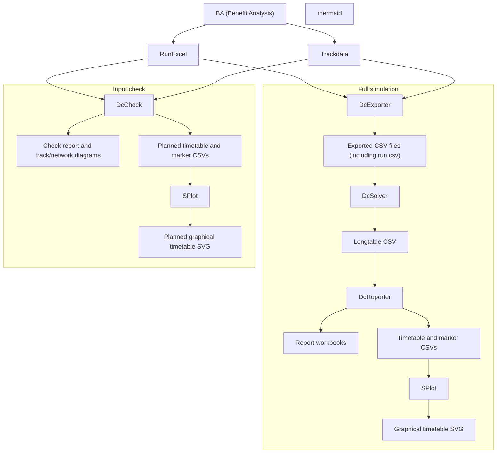

```mermaid
flowchart TD
   BA["BA (Benefit Analysis)"] --> RE["RunExcel"]
   BA --> TD["Trackdata"]
   mermaid
   subgraph Simulation["Full simulation"]
      EX["DcExporter"] --> CSV["Exported CSV files (including run.csv)"]
      CSV --> SOL["DcSolver"]
      SOL --> LT["Longtable CSV"]
      LT --> REP["DcReporter"]
      REP --> REPORTS["Report workbooks"]
      REP --> GT["Timetable and marker CSVs"]
      GT --> SP["SPlot"]
      SP --> SVG["Graphical timetable SVG"]
   end
   subgraph Check["Input check"]
      DC["DcCheck"] --> DIAG["Check report and track/network diagrams"]
      DC --> PLAN["Planned timetable and marker CSVs"]
      PLAN --> SPC["SPlot"]
      SPC --> SVGC["Planned graphical timetable SVG"]
   end
   RE --> EX
   TD --> EX
   RE --> DC
   TD --> DC
```